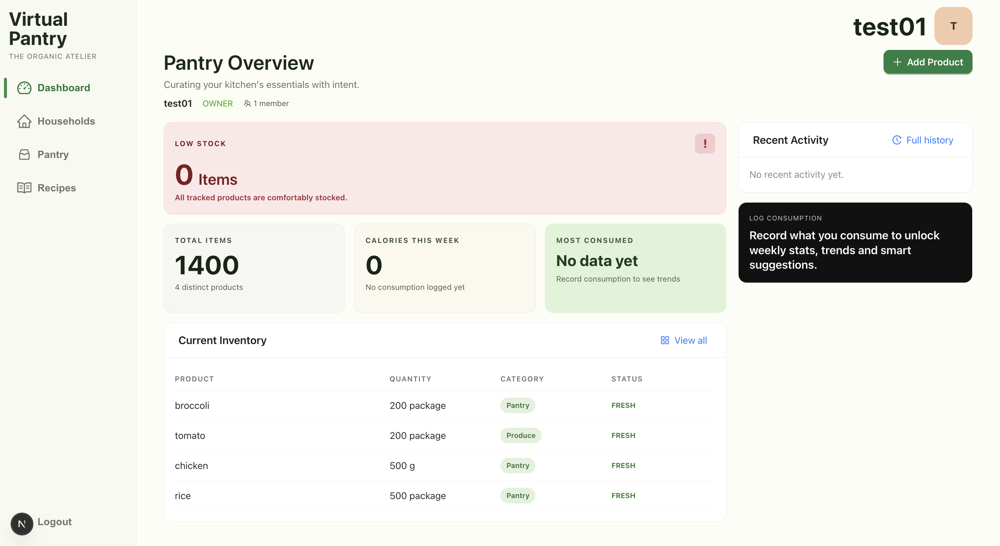
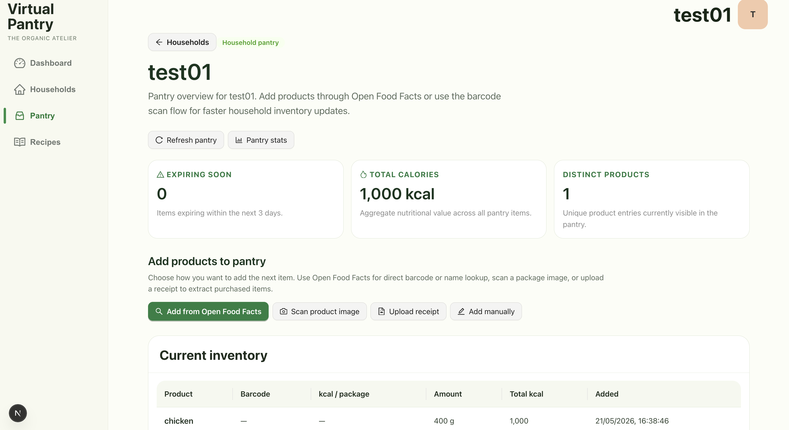
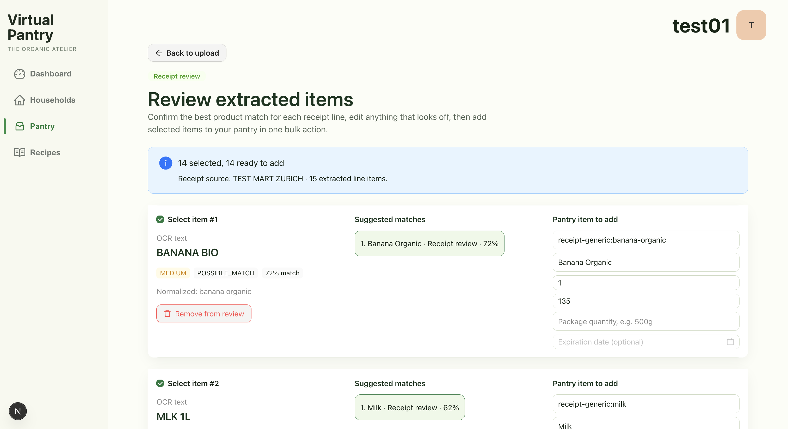
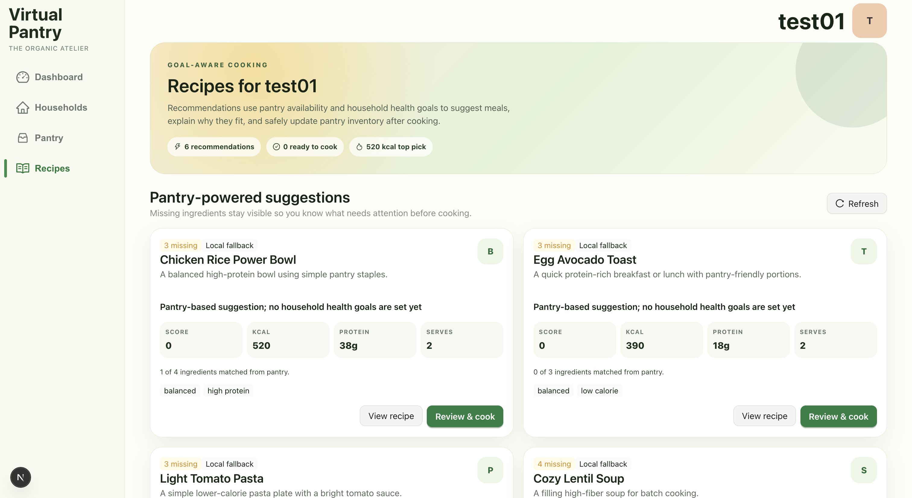
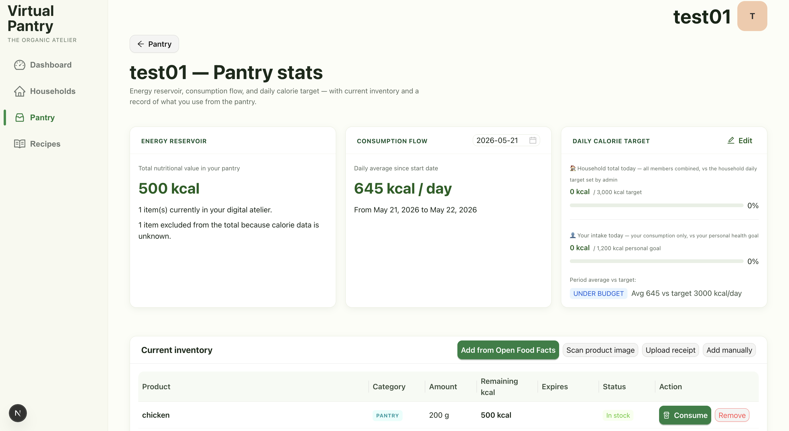

# Virtual Pantry

## Introduction

## Technologies Used

## High-Level Components

## Launch & Deployment

### Getting Started

These instructions will get you a copy of the project up and running on your local machine for development and testing purposes. See the Deployment section below for notes on how to deploy the project on a live system.

### Prerequisites

Make sure you have the following installed:

- [Node.js 22+](https://nodejs.org/) and npm
- [Java 17+](https://adoptium.net/)
- An [OpenAI API key](https://platform.openai.com/api-keys) (required for receipt scanning and meal recognition)

### Installing

Clone both repositories:

```bash
git clone https://github.com/sopra-fs26-group-09/sopra-fs26-group-09-server.git
git clone https://github.com/sopra-fs26-group-09/sopra-fs26-group-09-client.git
```

Start the backend:

```bash
cd sopra-fs26-group-09-server
OPENAI_API_KEY=<your-key> ./gradlew bootRun
```

The server starts on **http://localhost:8080**. An in-memory H2 database is created automatically — no database installation needed. You can inspect it at:

- URL: `http://localhost:8080/h2-console`
- JDBC URL: `jdbc:h2:mem:testdb`
- User: `sa`
- Password: *(leave empty)*

Start the frontend (from the parent directory):

```bash
cd ../sopra-fs26-group-09-client
npm install
npm run dev
```

Open **http://localhost:3000** in your browser.

### Running the tests

**Frontend**

```bash
npm test                    # single run
npm run test:coverage       # with coverage report
```

**Backend**

```bash
cd ../sopra-fs26-group-09-server
./gradlew test
```

### Deployment

Every push to `main` triggers the GitHub Actions workflows automatically:

- **Frontend** is deployed to [Vercel](https://vercel.com).
- **Backend** is deployed to [Google App Engine](https://cloud.google.com/appengine).

**One-time setup** (one team member per repo):

Frontend — add the following [repository secrets](https://docs.github.com/en/actions/security-guides/using-secrets-in-github-actions) to the client repo:
- `VERCEL_TOKEN`
- `VERCEL_ORG_ID`
- `VERCEL_PROJECT_ID`

And the following environment variable:
- `NEXT_PUBLIC_PROD_API_URL` — your backend's public URL (e.g. the App Engine URL). If not set, defaults to the hosted server URL defined in `app/utils/domain.ts`.

Backend — add the following secret to the server repo:
- `GCP_SERVICE_CREDENTIALS` (Google Cloud service account JSON)

**Build for production manually:**

```bash
# Frontend (from sopra-fs26-group-09-client)
npm run build
npm run start               # serves the build on http://localhost:3000

# Backend (from sopra-fs26-group-09-server)
./gradlew clean build
java -jar build/libs/*.jar
```

## Illustrations

Virtual Pantry is built around a shared household pantry. After authentication,
the user can create or join a household and use the household page as the main
entry point for managing food items. From there, items can be added manually,
through product lookup, by scanning a product image, or by uploading a receipt.
The pantry overview shows the current inventory and helps users keep track of
available quantities, product information, and expiry dates.

The receipt upload flow supports a more realistic shopping scenario. Instead of
directly importing every OCR result, the application first extracts receipt line
items and proposes product matches. The review screen then lets the user inspect
each extracted item, compare candidate products, correct details, remove
incorrect entries, and decide which items should be added to the pantry. This
keeps the interface transparent when OCR or product matching is uncertain.

The pantry data is reused throughout the rest of the application. Users can set
personal health goals and inspect household nutrition statistics based on stored
pantry and consumption data. The recipe page recommends meals from the current
pantry, highlights which ingredients are already available, lists missing
ingredients, and explains how well each recipe fits the household's health goals.
Recipe recommendations also indicate their source, such as the external recipe
API or the local fallback catalog.

The following screenshots illustrate the main user flows:











## Roadmap

## Authors and Acknowledgment

## License

This project is licensed under the [Apache License 2.0](LICENSE).
